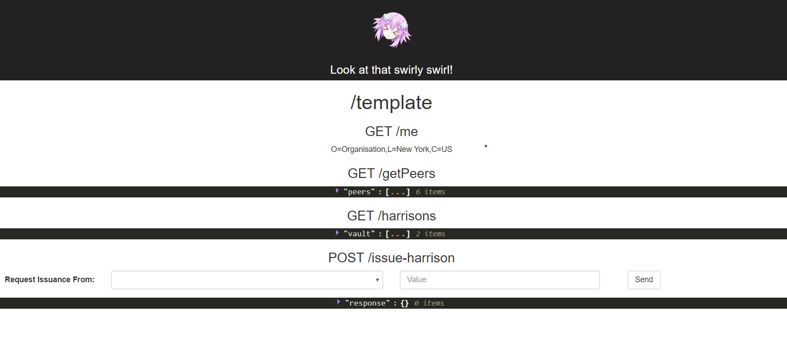

# Corda Frontend Harrison Bank

### Introduction: 
- This shows the Frontend of **Harrison Bank**.
- Front end of Harrison Bank is for requesting and issuing tokens in Corda Network.
- Designed for the Administrators of the organizations.
- This project was bootstrapped with [Create React App](https://github.com/facebookincubator/create-react-app).

### Prerequisite
NodeJS: 
```
https://nodejs.org/en/
```

### Getting Started:
- Once you install the dependencies.
- Run `npm install`.
- Run npm start.
- Open  `in localhost` to view in browser. 

### To Run the command:
 To run the command you have to follow :
 
 #### Steps:

- Runs the app in the development mode.<br>
- Open [http://localhost:3000](http://localhost:3000) to view it in the browser.
- The page will reload if you make edits.<br>
- You will also see any lint errors in the console.


### Deployment:
- Build the app for production to the `build` folder.<br>
- It correctly bundles React in production mode and optimizes the build for the best performance.
- The build is minified and the filenames include the hashes.<br>
- Your app is ready to be deployed!
 

### Available Scripts

In the project directory, you can run:

#### `npm start`

- Open [http://localhost:3000](http://localhost:3000).
- Open the page in browser.
- Ensure that you will get frontend page in return.


#### `npm test`

- Launches the test runner in the interactive watch mode.<br>
- See the section about [running tests](#running-tests) for more information.

#### `npm run build`

- Build the app for production to the `build` folder.<br>
- See the section about [deployment](#deployment) for more information.


 ### Appearance:
 
 - Each endpoint of the 'REST' Api connected the Corda Node is displayed with its corresponding response.
 - The post endpoint for requesting asset issuance also displays a form to input/submit the request.
 - Any error from requests will appear in the console.
 


### Requests
- The final requests made to each endpoint (And the functions that stuff.js will call) are specified in endpoints.js.
- There are also a couple of constructors for the data payloads that will head to these requests. 


### Credits: 
[**Harrison Mckenzie**](harrison.mckenzie@bcstechnology.com.au)


### Acknowledgment: 
- Harrison Bank
- [**Corda**](https://www.corda.net/)

